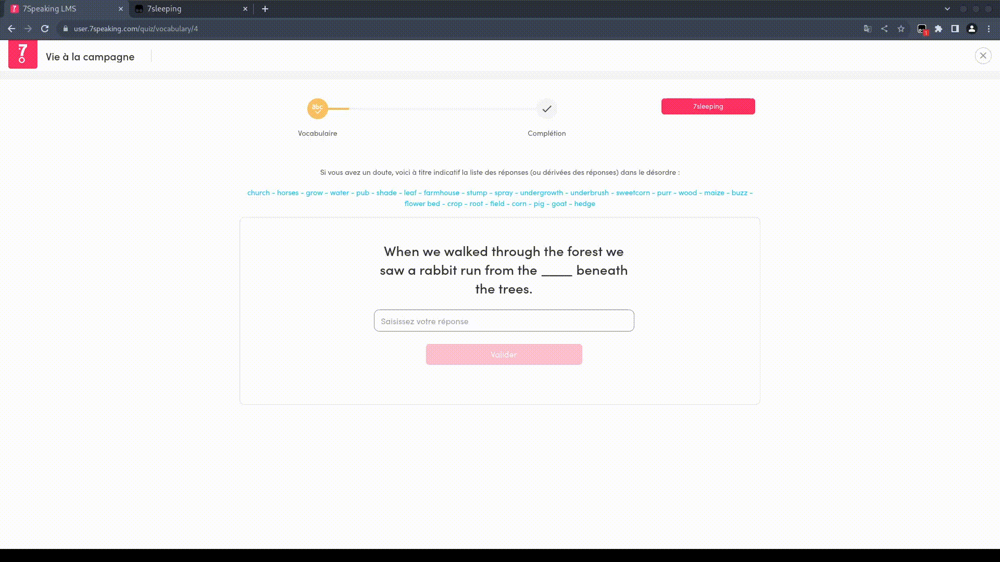

# 7sleeping

## Installation

- Get [this](https://www.tampermonkey.net/) extension on your browser
- Once tampermonkey installed and loaded, click on the plugin icon and on "Create a new script..."
- Paste the userscript.js in the code block, Ctrl+S and close
- Launch quizzes and go to sleep

## Demo

Once a quizz started, a button *7sleeping* should appear, once clicked the bot will solve the questions

## Debug

If there's bugs, send me the javascript console output and the quizz url

## Known Bugs

- There's a bug on quizz when you need to complete phrase, as a temporary solve the answer is written is pink in the question, so you need to copy and paste it.

## Disclaimer

ban = not my fault
